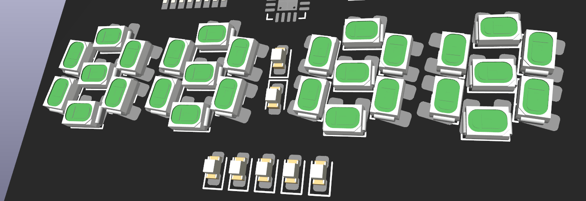

```
    __  ____________  _________   ________  ______  ____  _   __
   / / / / ____/ __ \/_  __/   | / ____/ / / / __ \/ __ \/ | / /
  / /_/ / __/ / /_/ / / / / /| |/ /   / /_/ / /_/ / / / /  |/ / 
 / __  / /___/ ____/ / / / ___ / /___/ __  / _, _/ /_/ / /|  /  
/_/ /_/_____/_/     /_/ /_/  |_\____/_/ /_/_/ |_|\____/_/ |_/   
```                                                                
## Heptachron - 7 segment LED wrist watch

### Concepts and ideas





### Features
 - [ ] 4 digits (hours and minutes)
 - [ ] Seconds displayed in binary (5 bits)
 - [ ] Always-on display
 - [ ] Rechargeable battery
 - [ ] Magnetic charger
 - [ ] Long battery life
 - [x] Megatron
 - [ ] Not waterproof
 - [ ] Very accurate

### Contributors

Gustav Abrahamsson, Adam Anderson, Martin Andersson 

